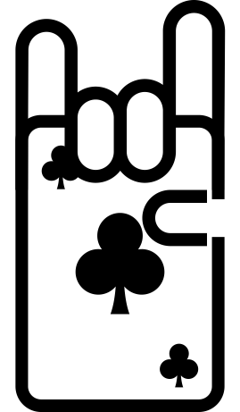

# 

# Doppelkopf Score Tracker
A modern, fast, and fully in-browser score tracker for the German card game Doppelkopf. This application is built with Streamlit and converted into a completely static, serverless web page using stlite, allowing it to be hosted anywhere.

## Features
Zero Backend Required: Runs entirely in your web browser thanks to WebAssembly.

Dynamic Score Tracking: Easily add new game results for normal and solo games.

Live Scoreboard: "Current Standings" are updated instantly after each game.

Detailed History: Game results are automatically grouped into tables by round for easy viewing.

Advanced Analytics: A dedicated tab visualizes score progression over time and calculates key player statistics like win rates and solo performance.

Customizable Cheatsheet: Includes a detailed cheat sheet with card rankings and reservation priorities, tailored to your specific house rules.

Simple Setup & Reset: A clean setup screen to enter player names and a one-click reset button to start a new session.

## Tech Stack
Streamlit: The core framework for building the application's UI and logic in Python.

stlite: A WebAssembly-powered port of Streamlit that runs the entire app in the browser.

Pandas: Used for data manipulation and creating the statistics tables.

Plotly: Powers the interactive score progression chart.

HTML/CSS: For the base structure and custom styling.

## Development & Building
The project is structured to allow for easy development in Python while deploying a single, static HTML file.

### Prerequisites
Python 3 installed on your local machine.

### File Structure
main.py: This is the main file where all the Streamlit application logic resides. You will edit this file to make changes to the app.

template.html: An HTML template that contains the stlite setup and a placeholder for the Python code.

build.py: A simple Python script that automatically combines streamlit_app.py and template.html into the final index.html.

### How to Build
#### Modify the App (Optional):
Make any desired changes to the application by editing the main.py file. For a faster development cycle, you can test your changes locally by running streamlit run main.py in your terminal.

#### Run the Build Script:
Once you are happy with your changes, run the build script from your terminal in the project's root directory:
```
python build.py
```
This command will read the contents of your Python app, inject them into the HTML template, and create the final index.html file.

#### Test the Static App Locally:
You cannot open index.html directly in the browser. It must be served by a local web server.

Navigate to the project directory in your terminal.

Run the command:
```
python -m http.server
```
Open your web browser and go to:
```
http://localhost:8000
```
## Deployment to GitHub Pages
You can host this app for free using GitHub Pages.

Create a Repository: Create a new public repository on your GitHub account.

Upload the File: Upload only the final, generated index.html file to your new repository.

Enable GitHub Pages:

In your repository, go to the Settings tab.

In the left sidebar, click on Pages.

Under "Build and deployment," set the Source to "Deploy from a branch."

Set the Branch to main (or whichever branch you uploaded the file to) and the folder to /root. Click Save.

### Done!
After a minute or two, your app will be live! GitHub will display the URL for your published site at the top of the Pages settings (e.g., https://<your-username>.github.io/<your-repo-name>/).
